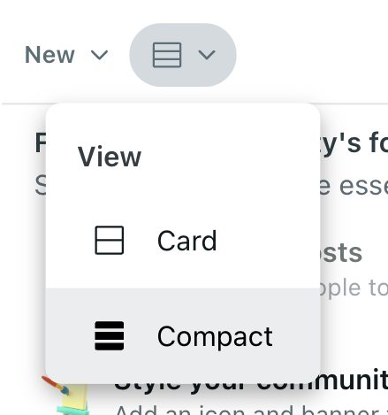

# MP-2: Building a Browser Extension

This repository contains the instructions and template files to complete our second mini-project!

## Overview

Training models and running statistical tests are powerful tools in an HCI researcher's toolbox, but how can a model or quantitative analysis actually reach communities and moderators? One way is by developing a tool or system that can be used in the real world by the target population. Interface design can enable researchers to implement novel interventions such as adding warnings to make users reflect (thread with caution), visualizations to add high-level summaries (convex), among many others.

For this MP, we're going to develop a simple browser extension using Javascript and CSS that will actually augment Reddit's interface to guide user attention where we want it to go! You have two tasks:

**Task 1:** *highlight all posts in the front page of the r/science that has been highly upvoted*. More precisely, add a green box around the posts that have a score of at least 200.

**Task 2:** *hide all posts in the front page of the r/science community that have not been highly upvoted until the user clicks to reveal the original post*. Specifically, add an *interstiatial* (i.e., an element that overlays another) to cover posts with a score less than 100. Add the ability to click the interstitial (or a button) to remove the interstitial and reveal the post.

Because of how Reddit renders its interface, please view the posts in **compact mode** (see the image below) and apply the highlight and interstitial elements to at least the top 10 posts. If you want to apply the elements to posts beyond the top 10, look into [**Mutation Observers**](https://developer.mozilla.org/en-US/docs/Web/API/MutationObserver), but this is not required!



Feel free to customize the design/appearance of your interface additions!

### Resources
* [Google Chrome's documentation](https://developer.chrome.com/docs/extensions)
  
## Files
To help you get started, we've provided you with a few starter files. Here is a summary of each one and why you would need to change it:

| File name            | Short description                                 |
|----------------------|---------------------------------------------------|
| [`webpack.config.js`](./webpack.config.js) | file to define how your files are bundled when built. Only edit this if you add new javascript files or css files. |
| [`public/manifest.json`](public/manifest.json) | file defining structure and permissions for your extension. See more information in the [documentation](https://developer.chrome.com/docs/extensions/reference/manifest).  |
| [`public/data/mp-logo.png`](public/data/mp-logo.png)| default logo to appear in the Chrome extension page.  |
| [`src/script.js`](src/script.js) | content script containing tool's actual behavior. Use this file to interact with webpage HTML. |
| [`src/script.css`](src/script.css) | here's where you should define the CSS for any custom elements you create and use in [`src/script.js`](src/script.js). |
---


## Setup

### Initializing and Installing
Once you've cloned the repo, open up a terminal. I recommend opening up a terminal within your IDE (e.g., I use VS code's terminal). In the terminal, run the following commands to initialize `npm`, a package manager which will help you manage the packages needed for your tool.

```bash
npm init -y
npm install --package-lock-only
npm audit fix --force
npm install --save-dev webpack webpack-cli
npm install --save copy-webpack-plugin querystring-es3 babel-loader
```
Once these run successfully, open up `package.json` and add make sure the following lines are in the `script` field.

```json
"scripts": {
  "watch": "webpack --watch",
  "build": "webpack",
  ...
}
```

Back in the terminal, run this command:
```bash
npm run watch
```
This helps rebuild your project automatically every time you save a new change to any of your files! The only exception is the `webpack.config.js` file. If you change that, you'll have to restart `npm run watch` manually to reflect the changes.

### Adding the extension to your browser

This extension will work on Google Chrome (and probably any browser built on Chromium like Brave, Vivaldi, Opera, etc.). 
1. Open up your browser and navigate to the extension page, [chrome://extensions/](chrome://extensions/) on Google Chrome.
2. In the upper right of the page, there should be a "Developer mode" switch. Turn it on!
3. To add the extension to your browser, click "Load unpacked" in the upper left and navigate to the `build` folder in your repository. It's important that you use the `build` folder and not the parent `mp-2-tool-building` directory.

This should add your extension to the browser! When you navigate to a webpage matching the pattern matching the `"matches"` field in [`public/manifest.json`](`public/manifest.json`) (default is any reddit.com webpage), the extension code in your content script (i.e., [`src/script.js`](`src/script.js`)) will run automatically!

### Workflow

Here is a sample workflow when you're developing:
1. Make a change to one of the files.
2. `npm` automatically rebuilds your project and updates the contents of `build`.
3. Navigate to the extension page in your browser, [chrome://extensions/](chrome://extensions/).
4. Click the reload button on your extension to grab the updated `build` files.
5. Refresh the webpage where your extension works and the changes should apply!

## What to submit

* `build-[NETID].zip`: the compressed build file. When extracted, the build folder inside should function when uploaded to the chrome extension page using the approach described above.
* *A written report for both tasks:* Using [this](???) template, include a PDF file of a few paragraphs describing your approach for each task and include screenshots showing how your interface elements work.
